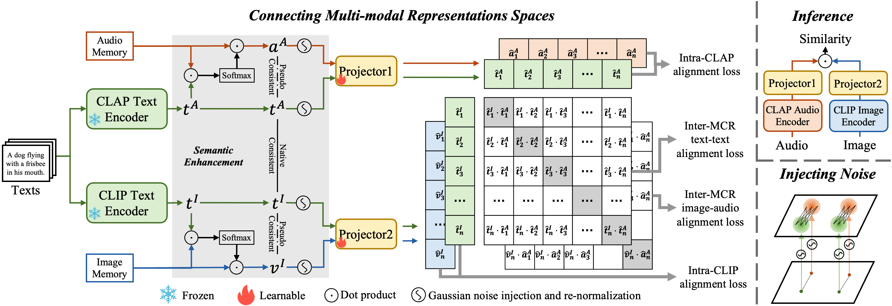

# C-MCR: Connecting Multi-modal Contrastive Representation
Zehan Wang∗, Yang Zhao, Xize Cheng, Haifeng Huang, Jiageng Liu, Li Tang, Linjun Li, Yongqi Wang, Aoxiong Yin, Ziang Zhang, Zhou Zhao†

C-MCR is a training-efficient and paired-data-free method to flexibly learn new multi-modal contrastive representations, by connecting two existing multi-modal contrastive representation spaces.

This implementation provides 3D-language contrastive representation by connecting CLIP and ULIP-2, and audio-visual contrastive representation by connecting CLIP and CLAP.



## News

- [10/11/2023] Source Code of C-MCR has been released! [[code](https://github.com/MCR-PEFT/C-MCR)]
- [09/22/2023] C-MCR has been accepted by NIPS 2023!🔥🔥🔥 [[paper](https://arxiv.org/abs/2305.14381)]

## File structure
```
-assets
	[demo samples, including image, audio and 3d model]
-checkpoints
	[pretrained weights for clip,clap,ulip and c-mcr_clap_clip, c-mcr_ulip_clip]
-cmcr
	- ULIP [source code of ULIP]
	cmcr_projector.py [the projector of c-mcr]
	trunks.py [feature extractor of clip, clap and ulip]
	cmcr_model.py [combine projector and trunks together with useful functions]
	type.py
		
```

## Usage
### Install enviornments
Install pytorch 1.13+ and other 3rd party dependencies.
```shell
conda create -n cmcr python=3.8.16
conda activate cmcr
pip install -r requirements.txt
```

All feature extractors we use and their pretrained weights are shown below. You need to download the weights for CLAP and ULIP and put them in directory `checkpoints` and renamed them. The weights for CLIP will be downloaded automatically during the first running.

- **CLIP**：vit/B-32, you can find the repository [here](https://huggingface.co/openai/clip-vit-base-patch32)
- **CLAP**：LAION_AI/CLAP 630k-fusion-best.pt, you can find the repository [here](https://github.com/LAION-AI/CLAP) and you can download the weight we use [here](https://huggingface.co/lukewys/laion_clap/blob/main/630k-fusion-best.pt).
- **ULIP**：pointbert v2, you can find the repository [here](https://github.com/salesforce/ULIP) and you can download the weight we use [here](https://storage.cloud.google.com/sfr-ulip-code-release-research/pretrained_models/ckpt_zero-sho_classification/pointbert_ULIP-2.pt)


The final structure of `checkpoints` looks like this:
```
-checkpoints
	clap_clip.pt
	ulip_clip.pt
	laion_clap_fullset_fusion.pt
	pointbert_ULIP-2.pt
```

### Inference

Extract and compare embeddings in C-MCR space across modalities:
```python
from cmcr.cmcr_model import C_MCR_CLAPCLIP, C_MCR_ULIPCLIP
from cmcr.cmcr_model import ModalityType, MCRType
import torch

input = {ModalityType.VISION: ['assets/toilet.jpeg',
                               'assets/BBQ.jpeg',
                               'assets/train.jpeg'],
         ModalityType.TEXT: ['a toilet',
                             'BBQ',
                             'a train'],
         ModalityType.AUDIO:['assets/toilet.wav',
                             'assets/BBQ.wav',
                             'assets/train.wav'],
         ModalityType.PC:['assets/toilet.npy',
                          'assets/BBQ.npy',
                          'assets/train.npy']
         }

device = 'cuda:0' if torch.cuda.is_available() else 'cpu'
clap_clip_model = C_MCR_CLAPCLIP(device=device)
ulip_clip_model = C_MCR_ULIPCLIP(device=device)

# you can get single modality embeddings by using these functions
# replace model by clap_clip_model or ulip_clip_model

# v_emb = model.get_vision_embedding(input)
# t_emb = model.get_text_embedding(input)
# a_emb = model.get_audio_embedding(input)
# p_emb = model.get_3d_embedding(input)

clap_clip_embeddings = clap_clip_model.get_embeddings(input)
ulip_clip_embeddings = ulip_clip_model.get_embeddings(input)

print('CLAP_CLIP')
print(
    "Vision x Text:\n",
    torch.softmax(clap_clip_embeddings[ModalityType.VISION] @ clap_clip_embeddings[ModalityType.TEXT].T * 10.0, dim=-1)
)
print(
    "Audio x Text:\n",
    torch.softmax(clap_clip_embeddings[ModalityType.AUDIO] @ clap_clip_embeddings[ModalityType.TEXT].T * 10.0, dim=-1)
)
print(
    "Audio x Vision:\n",
    torch.softmax(clap_clip_embeddings[ModalityType.AUDIO] @ clap_clip_embeddings[ModalityType.VISION].T * 10.0, dim=-1)
)

print('ULIP_CLIP')
print(
    "Vision x Text:\n",
    torch.softmax(ulip_clip_embeddings[ModalityType.VISION] @ ulip_clip_embeddings[ModalityType.TEXT].T * 10.0, dim=-1)
)
print(
    "3D x VISION:\n",
    torch.softmax(ulip_clip_embeddings[ModalityType.PC] @ ulip_clip_embeddings[ModalityType.VISION].T * 10.0, dim=-1)
)
print(
    "3D x Text:\n",
    torch.softmax(ulip_clip_embeddings[ModalityType.PC] @ ulip_clip_embeddings[ModalityType.TEXT].T * 10.0, dim=-1)
)


# Expected output

# CLAP_CLIP
# Vision x Text:
#  tensor([[0.9681, 0.0219, 0.0100],
#         [0.0403, 0.9398, 0.0199],
#         [0.0045, 0.0044, 0.9910]], device='cuda:0')
# Audio x Text:
#  tensor([[0.9937, 0.0028, 0.0035],
#         [0.0337, 0.9434, 0.0229],
#         [0.0813, 0.0253, 0.8934]], device='cuda:0')
# Audio x Vision:
#  tensor([[0.9712, 0.0079, 0.0208],
#         [0.0628, 0.8966, 0.0406],
#         [0.0322, 0.0062, 0.9616]], device='cuda:0')
# ULIP_CLIP
# Vision x Text:
#  tensor([[0.7340, 0.1593, 0.1067],
#         [0.2001, 0.5995, 0.2005],
#         [0.1622, 0.1835, 0.6542]], device='cuda:0')
# 3D x VISION:
#  tensor([[0.6783, 0.1781, 0.1436],
#         [0.1193, 0.7866, 0.0941],
#         [0.1319, 0.2170, 0.6512]], device='cuda:0')
# 3D x Text:
#  tensor([[0.7448, 0.1236, 0.1316],
#         [0.2459, 0.5625, 0.1916],
#         [0.2007, 0.2648, 0.5346]], device='cuda:0')
```

## TODO

- [x] Pre-trained C-MCR for ULIP-2, CLIP, CLAP (Unified 3D-image-text and audio-image-text representations)
- [ ] Code for training
- [x] Code for inference


## Citation
If you find this proiect useful in our research, please consider giving a star :star: and citation:
```
@misc{wang2023connecting,
      title={Connecting Multi-modal Contrastive Representations}, 
      author={Zehan Wang and Yang Zhao and Xize Cheng and Haifeng Huang and Jiageng Liu and Li Tang and Linjun Li and Yongqi Wang and Aoxiong Yin and Ziang Zhang and Zhou Zhao},
      year={2023},
      eprint={2305.14381},
      archivePrefix={arXiv},
      primaryClass={cs.LG}
}
```

lf you have any questions or suggestions, feel free to drop us an email ( wangzehan01@zju.edu.cn, ziangzhang@zju.edu.cn ) or open an issue.

### Acknowledgement 
Thanks to the open source of the following projects:
[CLIP](https://huggingface.co/openai/clip-vit-base-patch32), [CLAP](https://github.com/LAION-AI/CLAP), [ULIP](https://github.com/salesforce/ULIP), [Imagebind](https://github.com/facebookresearch/ImageBind).